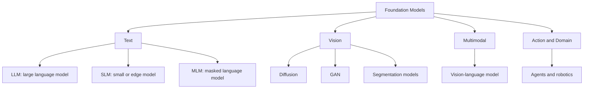
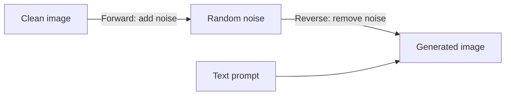
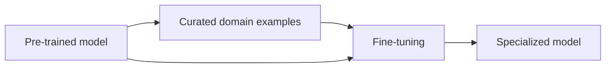
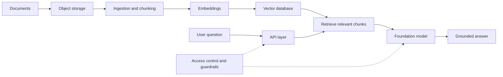

# Generative AI Systems and Architecture

Short interview study notes based on the supplied modules.

## Module 1: AI Taxonomy

### Predictive AI vs. Generative AI

| Type | Main question | Output | Examples |
| --- | --- | --- | --- |
| **Predictive AI** | What label, number, or ranking should I predict? | Class, score, probability, forecast | Spam detection, fraud detection, recommendations |
| **Generative AI** | What new content can I create from learned patterns? | Text, image, code, audio, video | Chatbots, image generation, code assistants |

**Memory shortcut:** Predictive AI forecasts; Generative AI creates.

### Foundation Models

Large, broadly trained models that can be adapted to many tasks.

- **LLM:** Generates and understands language.
- **SLM:** Smaller, faster, and suitable for local or edge use.
- **MLM:** Learns text meaning by masking and predicting missing words.
- **Diffusion model:** Generates content by removing noise step by step.
- **GAN:** Uses a Generator and Discriminator in competition.
- **VLM:** Connects vision and language.
- **Domain model:** Specialized for fields such as finance, law, biology, or healthcare.

## Module 2: Diffusion, NLP, and GANs

### Diffusion Process

- During training, noise is gradually added to real images.
- During generation, the model starts with noise and removes it.
- The prompt guides the final result.

### NLP Models vs. GANs

| Feature | Generative NLP | GAN |
| --- | --- | --- |
| Data | Tokens and text | Images or other media |
| Main parts | Transformer and self-attention | Generator and Discriminator |
| Goal | Predict the next token | Produce samples that look real |
| Strength | Context and instruction following | High-fidelity visual synthesis |
| Risk | Hallucination | Unstable training and mode collapse |

### Definitions and Examples

- **NLP (Natural Language Processing):** The field of AI that enables computers to understand, analyze, and generate human language. **Example:** A customer-support system classifies a message as a complaint and drafts a reply.
- **Generative NLP:** NLP that creates new language rather than only analyzing existing text. **Example:** A chatbot summarizes a report or writes a product description.
- **Transformer:** A neural-network architecture that uses attention to identify relationships between words or tokens, even when they are far apart in a sequence. **Example:** A language model uses the surrounding sentence to determine whether “bank” means a financial institution or a river bank.
- **Self-attention:** A mechanism that lets a model weigh the importance of other tokens when processing one token. **Example:** In “The animal did not cross the road because it was tired,” attention helps connect “it” with “the animal.”
- **GAN (Generative Adversarial Network):** A model made of a **Generator**, which creates samples, and a **Discriminator**, which tries to distinguish generated samples from real data. They learn through competition. **Example:** The Generator creates synthetic human faces while the Discriminator checks whether they look real.
- **Diffusion model:** A generative model trained to remove noise gradually and produce a meaningful output. **Example:** An image generator starts with random noise and creates a picture of a mountain from a text prompt.
- **VAE (Variational Autoencoder):** A model that learns a compact latent representation of data and samples from that representation to create similar new data. **Example:** A VAE generates new handwritten digits resembling examples from its training set.
- **Embedding:** A list of numbers that represents the meaning or characteristics of text, images, or other data. Similar items have nearby vectors. **Example:** A search system matches “how to reset my password” with a help article titled “Account recovery” even though the wording differs.
- **RAG (Retrieval-Augmented Generation):** A method that retrieves relevant information from an external knowledge source and gives it to a generative model as context. **Example:** An employee assistant retrieves the latest company policy before answering a leave question.
- **Fine-tuning:** Additional training on curated examples to adapt a pre-trained model to a particular task, style, or format. **Example:** A support model is fine-tuned to return every ticket in a consistent JSON structure.

## Module 3: History, Ethics, and Security

### Very Short History

- **1960s-1990s:** Rule-based systems, such as ELIZA.
- **2000s-2013:** Deep learning and representation learning grew.
- **2014-2017:** GANs, VAEs, and Transformers appeared.
- **2018-2022:** Large language models and instruction tuning scaled.
- **2023 onward:** Multimodal models and enterprise adoption expanded.

### Main Risks

- **Bias:** Training data can reproduce unfair patterns.
- **Privacy:** Sensitive data may be exposed or memorized.
- **Hallucination:** The model can produce confident but false answers.
- **Misinformation:** Generated text, images, and video can mislead people.
- **Prompt injection:** Untrusted content can manipulate model instructions.
- **Data poisoning:** Malicious training data can change model behavior.
- **Model theft:** Attackers may copy or reverse-engineer a model.

### Good Practices

- Keep a human in the loop for high-impact decisions.
- Do not share passwords, API keys, or confidential data in public tools.
- Ground answers in trusted sources when accuracy matters.
- Test AI-generated code for bugs and security issues.
- Log usage safely for auditing without storing unnecessary personal data.

## Module 4: API and Prompt Engineering

### Key Terms

- **Token:** A small piece of text processed by a model. Input and output tokens affect cost and limits.
- **Temperature:** Controls variation. Low values are focused; high values are more creative.
- **Maximum output tokens:** Limits response length.
- **Embedding:** A numerical representation of meaning used for search and similarity.

### Useful Temperature Guidance

- **Low:** Classification, extraction, coding, and consistent answers.
- **Higher:** Brainstorming, storytelling, and creative variations.

### Prompt Checklist

Include:

- Task and desired result
- Context and source material
- Audience, tone, and domain terms
- Output format, such as JSON or Markdown
- Rules, limits, and examples

### Common API Errors

| Status | Meaning | Typical response |
| --- | --- | --- |
| `401` | Authentication failure | Check key and configuration |
| `404` | Resource or endpoint not found | Check model and URL |
| `429` | Rate limit or quota exceeded | Back off, retry, cache, or queue |
| `500` | Provider-side failure | Retry safely and show a clear message |

## Module 5: NLP, Fine-Tuning, and Audio

### Common NLP Uses

- Code completion, explanation, refactoring, and review
- Sentiment analysis: positive, negative, neutral, or custom labels
- Semantic search and recommendations with embeddings
- Clustering similar documents without manual labels

### Fine-Tuning

- Fine-tuning adapts a model to a task, style, format, or vocabulary.
- Use clean, representative examples and separate evaluation data.
- Measure quality with task-appropriate metrics such as precision, recall, and F1.
- Consider prompting or RAG first; fine-tuning changes behavior but does not reliably add fresh facts.

### Multimodal APIs

- **Image generation:** Creates images from text.
- **Inpainting:** Edits a selected image region using a mask.
- **Vision-language:** Connects images with text understanding.
- **Speech recognition:** Converts audio to text.
- **Text-to-speech:** Converts text to spoken audio.
- **Audio translation:** Transcribes speech into another language.

## Module 6: Enterprise Architecture and AWS Design

### Main Architecture Layers

1. **Interface:** Web apps, APIs, SDKs, and API Gateway.
2. **Orchestration:** Agents, workflows, queues, or Step Functions.
3. **Model:** Foundation model APIs or hosted models.
4. **Data:** Object storage, documents, embeddings, and vector databases.
5. **Observability:** Logs, metrics, traces, cost, and quality signals.

### RAG Architecture

- **RAG** retrieves trusted context before generation.
- A typical AWS design can use S3, a knowledge-base ingestion service, a vector store, API Gateway, Lambda or workflows, IAM, and monitoring.
- Keep documents authoritative, access-controlled, encrypted, and versioned.

### Six Architecture Priorities

- Operational excellence
- Security
- Reliability
- Performance efficiency
- Cost optimization
- Sustainability

### POC Rule

A proof of concept tests the riskiest assumptions with measurable targets for quality, latency, cost, integration, and safety. The decision is **proceed, revise, or stop**.

## Module 7: Gemini and NotebookLM

| Feature | Gemini | NotebookLM |
| --- | --- | --- |
| Main purpose | General reasoning, creation, coding, and planning | Research based on supplied sources |
| Grounding | General knowledge and available search/tools | User-uploaded documents and sources |
| Best for | Open-ended questions and multimodal tasks | Summaries, study help, and source-linked answers |
| Key advantage | Broad assistant and workspace integration | Source-focused synthesis and citations |

**Tool choice:** Use a general assistant for broad reasoning; use a source-grounded notebook when traceability to provided documents matters most.

## Final Interview Recap

1. Predictive AI forecasts; Generative AI creates.
2. Transformers are strong at language; diffusion models are strong at image generation; GANs compete to create realistic samples.
3. RAG adds trusted external context without retraining the model.
4. Fine-tuning changes task behavior; it is not a replacement for current knowledge retrieval.
5. Production systems need security, evaluation, monitoring, cost control, and human review.
6. Choose tools based on the task: broad reasoning versus source-grounded research.