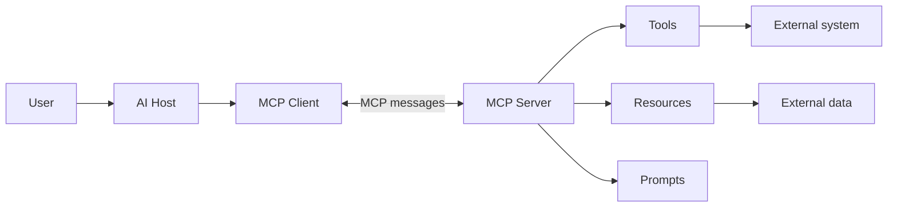

# MCP Study Notes

## 1. What Is MCP?

**MCP (Model Context Protocol)** is an open standard that lets AI applications connect to external data and tools in a common way.

### Simple idea

> MCP is like a standard adapter between an AI app and useful external services.

Without MCP, every AI app may need a different integration. With MCP, one common protocol can be used.

## 2. Main Parts

| Part | Meaning |
| --- | --- |
| **Host** | The AI application, such as an IDE or chat app |
| **Client** | The connector inside the host; it communicates with one MCP server |
| **Server** | A program that provides data, actions, or instructions |
| **User** | Gives the request and approves sensitive actions |

## 3. What an MCP Server Provides

MCP capabilities can be grouped as follows:

- **Tools**: Actions the AI can call, such as searching, querying, or creating a file.
- **Resources**: Information the AI can read, such as files, documents, or database data.
- **Prompts**: Reusable prompt templates or workflows.

## 4. How MCP Works



### Request flow

1. The user asks the AI to do something.
2. The host asks an MCP server what it can provide.
3. The AI selects a suitable tool, resource, or prompt.
4. The client sends an MCP request to the server.
5. The server returns a result.
6. The host shows the result or asks the user for approval.

## 5. Communication

- MCP uses structured messages based on **JSON-RPC**.
- A connection uses a transport, such as local standard input/output or HTTP-based streaming.
- The protocol handles discovery, requests, results, and errors.

## 6. Security Points

- Give a server only the permissions it needs.
- Treat tool results and external content as untrusted input.
- Ask for user approval before destructive or sensitive actions.
- Keep API keys and passwords out of prompts and source code.
- Use trusted MCP servers and review their actions.

## 7. Benefits

- One common integration pattern for many AI applications.
- Reusable tools and data connections.
- Easier maintenance than many custom integrations.
- Clear separation between the AI host and external services.
- Better control over permissions and user approval.

## 8. Quick Memory Trick

**Host uses a Client to connect to a Server.**

The server offers:

- **Tools** to do things
- **Resources** to read things
- **Prompts** to guide things

> **MCP = AI + standard connection + external capabilities**

## 9. One-Line Example

An AI coding editor (**host**) uses an MCP client to connect to a GitHub MCP server (**server**) and use a tool to search issues or read repository data.

## 10. Execution Context for Agents

Execution context defines where an agent works and what it can do.

### Main boundaries

- **Repository scope**: The agent works inside one selected repository.
- **Branch scope**: Changes are made on a separate branch before review.
- **Workflow scope**: GitHub Actions defines when and where a task runs.
- **Permission scope**: Workflow permissions define access to code, pull requests, and secrets.

### Custom agent scope

Custom agents can further limit their work inside a repository.

- Store agents in `.github/agents/`.
- Use an `.agent.md` file.
- Use `applyTo` to target files or folders.
- Use `tools` to limit available actions.

Example:

```yaml
applyTo:
    - "**/*.js"
    - "src/auth/**"
tools:
    - read_file
    - search_files
```

Custom agents control focus and tools. They do not control branch creation or pull request behavior.

### Workflow boundaries

Workflows provide a controlled execution environment:

- Run on a selected event, such as `workflow_dispatch` or `pull_request`.
- Use a defined runner, such as `ubuntu-latest`.
- Check out the repository.
- Run tests or agent tasks.
- Capture logs and results.

Minimal workflow structure:

```yaml
name: Agent Task

on:
    workflow_dispatch:

permissions:
    contents: read

jobs:
    agent-task:
        runs-on: ubuntu-latest
        steps:
            - uses: actions/checkout@v4
            - uses: actions/setup-node@v4
                with:
                    node-version: "18"
            - run: npm test
```

### Permission rules

- Start with read-only permissions.
- Grant write access only when required.
- Keep secrets out of prompts and agent runtime when possible.
- Never give an agent more access than the task needs.

### Key takeaway

Safe agent execution combines:

**Repository scope + branch isolation + workflow control + minimal permissions**