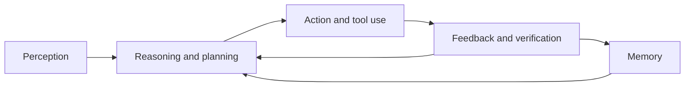

# Agentic AI Short Notes

Short and simple notes on the basic ideas, working process, applications, and risks of agentic AI.

## 1. What Is Agentic AI?

**Agentic AI** is an AI system that can understand a goal, make a plan, use tools, take actions, check results, and adjust its approach with limited step-by-step human guidance.

**Very short example:** Instead of only suggesting a flight, a travel agent searches flights, compares prices, books the selected option, and finds an alternative if the flight is cancelled.

### Traditional AI vs. Agentic AI

| Feature | Traditional AI | Agentic AI |
| --- | --- | --- |
| Behavior | Reactive: waits for input | Goal-directed: works toward an objective |
| Decision-making | Produces a predicted result | Chooses between actions and alternatives |
| Autonomy | Follows fixed logic | Acts independently within rules |
| Tool use | Usually performs internal computation | Calls APIs, databases, code, or other tools |
| Memory | Often treats requests independently | Uses short-term or long-term context |
| Adaptation | Needs human retraining or changes | Adjusts its plan using feedback |

**Memory shortcut:** Traditional AI predicts; agentic AI perceives, plans, acts, and adapts.

## 2. Core Properties

- **Autonomy:** Continues a task without a human directing every step.
- **Goal-directed behavior:** Chooses actions that help achieve a target.
- **Perception:** Collects and interprets messages, documents, images, logs, sensors, or other signals.
- **Reasoning and planning:** Breaks a goal into steps and evaluates possible paths.
- **Action:** Uses tools, APIs, workflows, or external systems to do something.
- **Memory:** Stores useful context, previous actions, results, and preferences.
- **Feedback:** Checks outcomes and changes course when something fails.
- **Self-reflection:** Reviews its own plan or result and corrects mistakes.

**Short example:** A support agent reads “My Internet is down,” checks the customer's history, runs a modem diagnostic, resets the modem, and asks whether the connection is working.

## 3. The Agentic Loop

1. **Perceive:** Understand the request and current situation.
2. **Reason and plan:** Select tools and decide the order of actions.
3. **Act:** Execute a function, API call, query, message, or workflow.
4. **Verify:** Check whether the action produced the expected result.
5. **Use feedback:** Detect errors or changes and revise the plan.
6. **Use memory:** Retain context and useful experience for later steps or sessions.

## 4. Where Agentic AI Is Used

- **Customer support:** Troubleshoots issues, remembers history, and escalates unusual cases.
- **Research:** Searches sources, summarizes papers, tracks trends, and drafts reports.
- **Software development:** Reads issues, writes code, runs tests, and helps debug failures.
- **Healthcare:** Supports triage, reminders, monitoring, and clinical decision support.
- **Education:** Adjusts explanations, pace, and difficulty for each learner.
- **Travel:** Compares flights and hotels and adapts the itinerary when conditions change.

Agentic AI is most useful for work that is too dynamic for a simple script but too repetitive for a person to perform manually.

## 5. Limitations and Risks

- **Wrong decisions:** A misunderstanding can lead to harmful actions.
- **Poor or biased input:** Incomplete, outdated, or adversarial data can distort perception.
- **Planning failures:** The agent may optimize a local target while missing the user's real preference.
- **Unsafe tool use:** Incorrect API assumptions or missing validation can cause failures.
- **Error accumulation:** One bad action can trigger more bad actions through the loop.
- **Hallucinations:** The agent may invent facts, results, or citations.
- **Value misalignment:** The system may optimize a metric instead of the user's actual intent.
- **Low transparency:** Multi-step decisions can be difficult to audit.

**Short example:** A travel agent told to find the cheapest trip may choose three layovers and a 3 AM arrival. It ignored comfort preferences because the goal and constraints were incomplete.

## 6. Responsible Agent Design

- Define the goal and user preferences clearly.
- Apply permissions, policies, and safety guardrails.
- Validate important tool calls before execution.
- Require confirmation for high-impact or irreversible actions.
- Monitor actions, results, and failures with useful logs.
- Verify outcomes instead of assuming success.
- Keep human oversight for high-stakes areas such as healthcare and finance.

**Key idea:** Autonomy must be balanced with accountability.

## 7. Knowledge Check Answers

### Self-reflection

Correct answers:

1. Automatically rerunning steps after detecting a faulty outcome.
3. Asking, “Does this plan meet the goal?” and adjusting if not.

### Perception

Correct answer:

3. Sense, interpret, and understand input data or environmental signals.