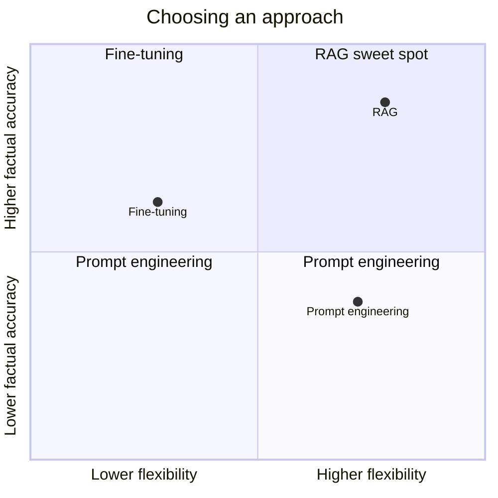
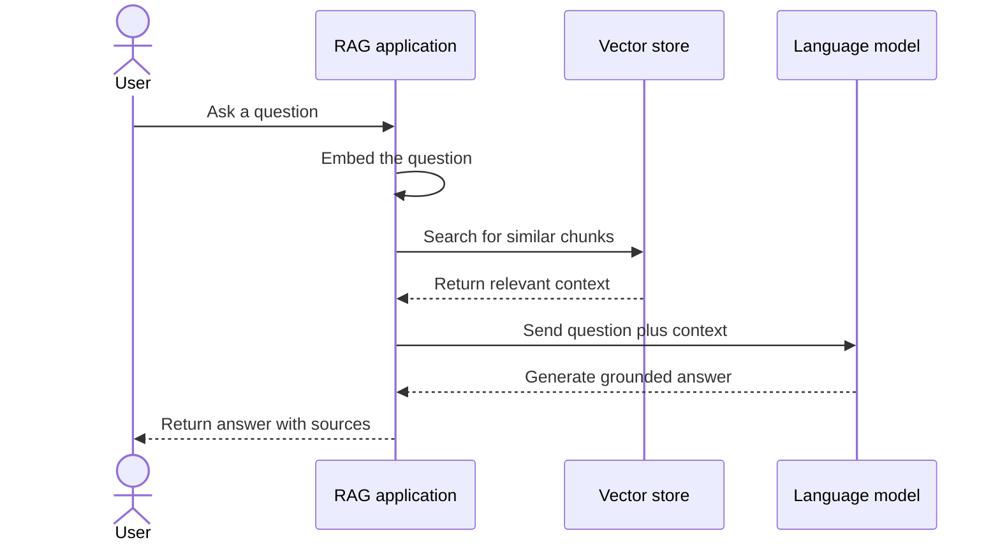

# Retrieval-Augmented Generation (RAG)

## Anatomy of a RAG Pipeline

### Pipeline stages

| Stage | Purpose |
| --- | --- |
| **Documents** | Source material such as files, web pages, manuals, or database records. |
| **Chunking** | Splits documents into smaller passages that can be searched effectively. |
| **Embeddings** | Converts each passage into a numerical vector representing its meaning. |
| **Vector Store** | Stores the vectors and their source text for similarity search. |
| **Retriever** | Finds the passages most relevant to the user's question. |
| **LLM** | Uses the question and retrieved passages to generate a grounded response. |

## RAG vs. Fine-Tuning vs. Prompt Engineering

| Approach | Primary purpose | Cost | Flexibility | Factual accuracy |
| --- | --- | --- | --- | --- |
| **Prompt engineering** | Improve instructions and phrasing | Low | High | Limited |
| **Fine-tuning** | Teach the model patterns from new examples | High | Low | Moderate |
| **RAG** | Combine retrieved facts with model reasoning | Medium | High | High |

## Query-time flow

