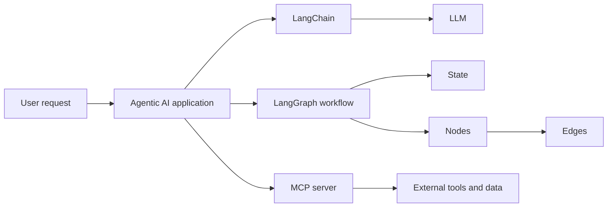
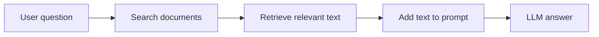
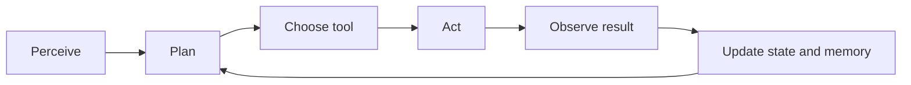
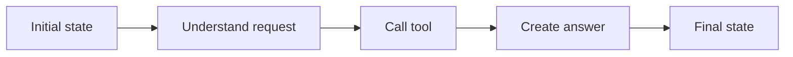
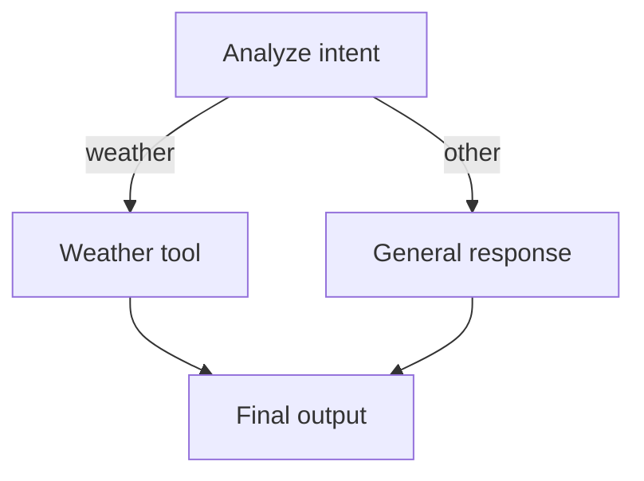

# Doubts Clear Notes

**Topic:** LLM, LangChain, RAG, MCP, Agentic AI, and LangGraph  
**Created:** 2026-08-21 17:06:47

## 1. Quick Overview

- **LLM:** The language model that understands and generates text.
- **LangChain:** open-source framework for building LLM-powered applications.
- **LangGraph:** A graph-based framework for building controlled, stateful workflows and agents.
- **MCP:** A standard way for AI applications to discover and use external tools and data.
- **Agentic AI:** A system that can understand a goal, plan steps, use tools, observe results, and adapt.

## 2. How They Relate



- An application can use an **LLM** directly for text generation.
- **LangChain** helps connect the LLM to prompts, tools, retrievers, and output parsers.
- **LangGraph** organizes multiple steps into a workflow with state and routing.
- **MCP** can expose tools and resources to the application through a standard interface.
- **Agentic AI** is the overall behavior created by combining reasoning, memory, planning, tools, and feedback.

## 3. What Is an LLM?

An **LLM**, or Large Language Model, is an AI model trained on large amounts of text.

### What an LLM Can Do

- Understand natural-language instructions.
- Generate answers, summaries, and code.
- Classify or extract information from text.
- Choose a tool when tool definitions are provided.

### What an LLM Does Not Automatically Provide

- Reliable long-term memory.
- Guaranteed factual accuracy.
- Automatic access to private databases or APIs.
- A complete multi-step workflow controller.

**Simple idea:** An LLM is the reasoning and language engine, not the entire application.

## 4. What Is LangChain?

**LangChain** is a development framework for connecting LLMs with application components.

### Common LangChain Building Blocks

- Prompt templates.
- Chat model integrations.
- Tool and function calling.
- Document loaders and text splitters.
- Embeddings and vector stores.
- Retrievers for RAG applications.
- Output parsers and structured responses.

### Simple LangChain Flow

```text
User input -> Prompt -> LLM -> Parser -> Application response
```

LangChain is useful when an application needs reusable components around an LLM.

## 5. What Is RAG?

**RAG**, or Retrieval-Augmented Generation, gives an LLM useful information from an external knowledge source before it generates an answer.

### Simple RAG Flow



1. The user asks a question.
2. The system searches documents, files, or a database.
3. It retrieves the most relevant text.
4. The retrieved text is added to the LLM prompt as context.
5. The LLM generates an answer using that context.

**Easy example:** If a user asks, “What is our leave policy?”, RAG searches the company handbook and gives the relevant section to the LLM. The LLM then explains the policy instead of guessing from general training.

### Why Use RAG?

- Use private company or project information.
- Answer questions about current documents without retraining the LLM.
- Reduce guessing by grounding answers in retrieved context.
- Return source names or citations when the application supports them.

## 6. RAG Search Types

### 1. Keyword Search

- Finds exact words or related word matches.
- Good for names, IDs, error codes, and exact phrases.

**Example:** Searching `ERR-401` finds documents containing `ERR-401`.

### 2. Semantic or Vector Search

- Finds meaning instead of only matching exact words.
- Text is converted into embeddings, which are numerical representations of meaning.

**Example:** Searching “How can I get my money back?” can find a document titled “Refund and cancellation policy,” even when the word `refund` was not used in the question.

### 3. Metadata-Filtered Search

- Filters documents using fields such as date, author, department, language, or document type.
- Often works together with keyword or vector search.

**Example:** Search only `HR` documents created after `2025`.

### 4. Hybrid Search

- Combines keyword search and semantic/vector search.
- Useful when both exact terms and meaning are important.

**Example:** Find documents about the exact product code `A-100` that also relate to installation problems.

### Search Type Comparison

| Search type | Best for | Easy example |
| --- | --- | --- |
| Keyword | Exact words and codes | `ERR-401` |
| Semantic/vector | Meaning and natural questions | “How do I get a refund?” |
| Metadata filter | Known document properties | HR documents from 2025 |
| Hybrid | Exact terms plus meaning | Product code plus issue description |

## 7. Very Easy RAG Example

Imagine a small knowledge base containing:

```text
Document: company_handbook.txt
Text: Employees receive 20 paid vacation days each year.
```

The user asks:

```text
How many vacation days do employees receive?
```

The RAG system works like this:

```text
Question
    -> Search handbook
    -> Retrieve: "Employees receive 20 paid vacation days each year."
    -> Send question and retrieved text to the LLM
    -> Answer: "Employees receive 20 paid vacation days each year."
```

Without RAG, the LLM may not know the company's private policy. RAG supplies the missing context at question time.

### Important RAG Terms

- **Document:** Original source such as a PDF, webpage, or database record.
- **Chunk:** Smaller piece of a document used for search.
- **Embedding:** Numerical representation of text meaning.
- **Vector store:** Database that stores embeddings and supports similarity search.
- **Retriever:** Component that returns relevant chunks.
- **Context:** Retrieved text sent to the LLM.

**Memory shortcut:** RAG retrieves knowledge; the LLM uses that knowledge to generate an answer.

## 8. What Is MCP?

**MCP**, or Model Context Protocol, is a standard for connecting AI applications to external tools, resources, and prompts.

### MCP Components

- **MCP host:** The AI application, such as an assistant or agent.
- **MCP client:** The connection inside the host.
- **MCP server:** Provides tools, resources, or prompts.
- **Tool:** An operation the AI can call.
- **Resource:** Data the AI can read.

### Example MCP Tools

- Search a project repository.
- Read a database record.
- Create a support ticket.
- Query an internal API.
- Read files from an approved location.

**Simple idea:** MCP is a communication standard. It does not replace the LLM, LangChain, or LangGraph.

## 9. What Is Agentic AI?

**Agentic AI** describes AI systems that work toward goals through multiple controlled steps.

### Agentic Loop



1. **Perceive:** Understand the request and context.
2. **Plan:** Break the goal into tasks.
3. **Choose:** Select a node, tool, or route.
4. **Act:** Execute the selected operation.
5. **Observe:** Check the result.
6. **Adapt:** Update state, retry, ask for clarification, or finish.

LangGraph is especially useful for implementing this loop because it makes each step and transition explicit.

## 10. What Is LangGraph?

**LangGraph** is a framework for defining AI workflows as graphs.

A graph contains:

- **State:** Shared data that moves through the workflow.
- **Nodes:** Functions that perform work.
- **Edges:** Connections that decide what runs next.
- **StateGraph:** The container that holds and coordinates the graph.

LangGraph is useful when a task has multiple steps, branching decisions, loops, retries, or human approval.

## 11. LangGraph State

### What Is State?

**State** is the shared data structure available to all nodes in a LangGraph workflow.

It can contain:

- The user's original question.
- Conversation messages.
- Retrieved documents.
- Tool results.
- Current processing step.
- Routing decisions.
- Errors and retry counts.
- The final answer.

State acts like the workflow's shared memory. A node reads the current state and returns updates to it.

### Typed State Example

```python
from typing import TypedDict

class AgentState(TypedDict):
    user_input: str
    intent: str
    tool_result: str
    final_answer: str
```

The `TypedDict` defines the expected fields and types. It makes the data contract clear for every node.

### State Flow Example



- The initial state contains the user's input.
- The understanding node adds the detected intent.
- The tool node adds external information.
- The answer node uses all previous fields to create the result.

### Common State Update Patterns

| Pattern | Meaning | Example |
| --- | --- | --- |
| **Replace** | Overwrite the old value | `current_step = "complete"` |
| **Accumulate** | Add new items to existing data | Append a new message or finding |
| **Merge** | Combine dictionary updates | Add or update metadata fields |

## 12. What Are Nodes?

A **node** is a function that performs one step in a LangGraph workflow.

A node usually:

1. Receives the current state.
2. Reads the fields it needs.
3. Performs work.
4. Returns updates to the state.

### Node Example

```python
def analyze_node(state: AgentState) -> dict:
    user_input = state["user_input"].lower()

    if "weather" in user_input:
        intent = "weather"
    else:
        intent = "general"

    return {
        "intent": intent,
        "current_step": "analyzed",
    }
```

This node reads `user_input`, classifies it, and returns state updates. It does not need to return the entire state.

### Typical Node Types

- **Input node:** Receives and prepares user input.
- **Analysis node:** Detects intent or extracts information.
- **Retriever node:** Searches documents or a vector store.
- **Tool node:** Calls an API, database, browser, or external service.
- **Decision node:** Selects the next route.
- **Generation node:** Uses an LLM to produce a response.
- **Validation node:** Checks whether the result is complete and valid.
- **Human approval node:** Pauses for human review.
- **Output node:** Formats the final response.

## 13. What Are Edges?

**Edges** define the direction of execution between nodes.

### Normal Edge

A normal edge always follows the same path:

```text
input -> analyze -> respond -> END
```

### Conditional Edge

A conditional edge chooses a path based on state:

```python
def choose_route(state: AgentState) -> str:
    if state["intent"] == "weather":
        return "weather_tool"
    return "general_response"
```



## 14. Comparison Table

| Technology or idea | Main purpose | Main question it answers |
| --- | --- | --- |
| **LLM** | Understand and generate language | What should the system say or infer? |
| **LangChain** | Connect LLMs to application components | How do I integrate the model with prompts and tools? |
| **LangGraph** | Control multi-step stateful workflows | What runs next, and what data is shared? |
| **MCP** | Standardize access to tools and resources | How can an AI application connect to external capabilities? |
| **Agentic AI** | Describe goal-directed autonomous behavior | How can the system plan, act, observe, and adapt? |

## 15. One Practical Example

### Customer Support Agent

```text
User asks about an order
        |
        v
Input node stores the request in state
        |
        v
Analysis node identifies intent: order_status
        |
        v
Conditional edge selects the order API tool
        |
        v
Tool node retrieves order information
        |
        v
Generation node creates a clear response
        |
        v
Output node returns the answer
```

- The **LLM** understands the user's language.
- **LangChain** can connect the model to prompts and the order tool.
- **LangGraph** controls the nodes, edges, and state flow.
- **MCP** can provide the order lookup tool through an MCP server.
- The complete system demonstrates **agentic AI** behavior.

## 16. Common Doubts Cleared

### Is LangGraph an LLM?

No. LangGraph controls workflow execution. It can use an LLM inside one or more nodes.

### Is LangChain the same as LangGraph?

No. LangChain provides integrations and building blocks. LangGraph focuses on graph-based, stateful workflow control. They can be used together.

### Is state the same as model memory?

Not exactly. LangGraph state is workflow data passed between nodes during execution. Long-term memory usually requires a separate storage or retrieval system.

### Is a node always an LLM call?

No. A node can be any Python function: an LLM call, API request, database query, validation step, calculation, or human approval step.

### Are edges the same as nodes?

No. Nodes do the work. Edges decide how execution moves between nodes.

### Does MCP make an AI agent autonomous?

No. MCP provides standardized access to capabilities. Planning, permissions, workflow logic, and safety controls are still needed.

### Does every AI application need LangGraph?

No. A single prompt-and-response application may only need an LLM. LangGraph becomes valuable when the application has multiple steps, state, branching, retries, or human review.

## Quick Recap

- The **LLM** provides language understanding and generation.
- **LangChain** connects LLMs to prompts, tools, retrieval, and application code.
- **LangGraph** creates controlled workflows with StateGraph, nodes, edges, and state.
- **MCP** standardizes how AI applications access external tools and resources.
- **Agentic AI** is goal-directed behavior built from reasoning, planning, action, observation, and adaptation.
- **State** is shared workflow data; **nodes** are the functions that read and update it.
